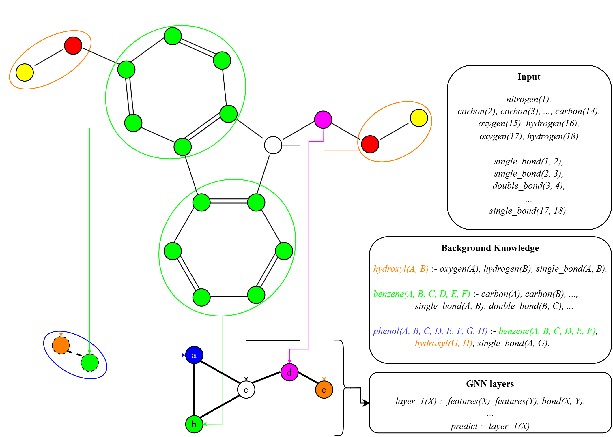
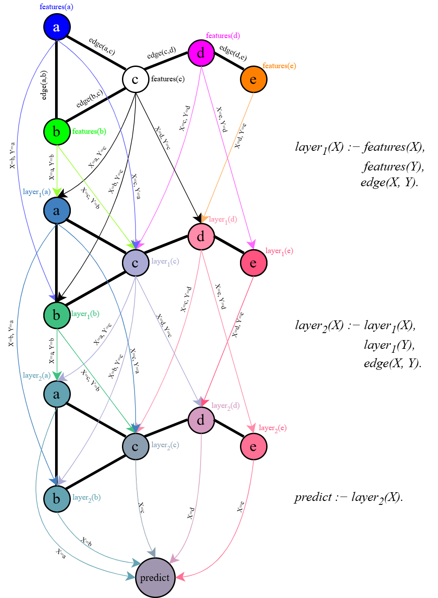
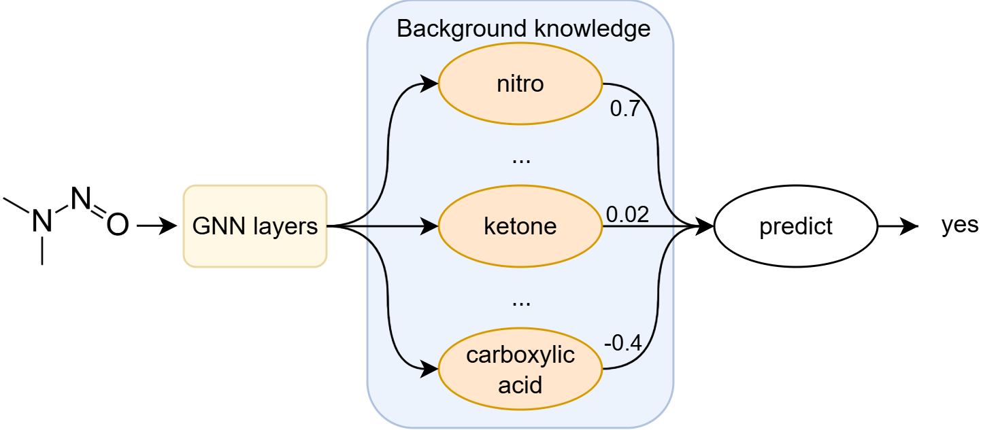
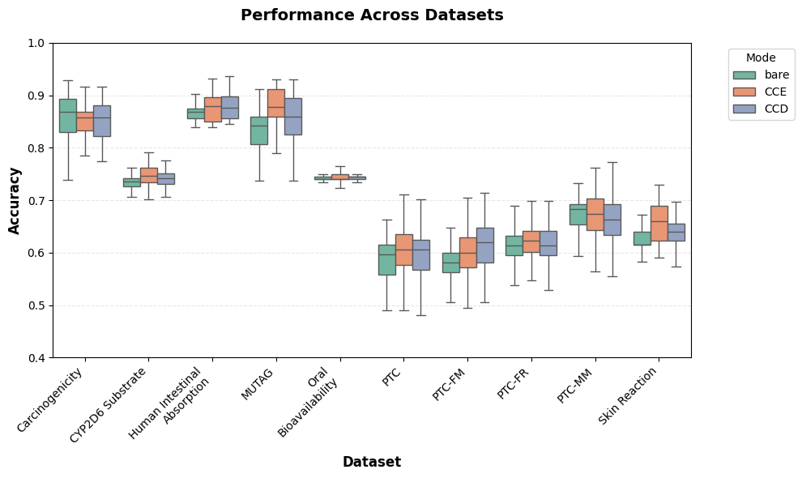

# ChemLogic

Chemlogic is a **Neurosymbolic GNN** framework designed for interpretable molecular property prediction. It integrates relational logic syntax with graph neural networks to encode functional groups and structural patterns as learnable rules.

Built on [PyNeuraLogic](https://github.com/LukasZahradnik/PyNeuraLogic).

Read the paper: TBD

## Install

```bash
pip install ChemLogic
```

## Dependencies

ChemLogic requires Python 3.11 and Java >=1.8. For visualization `graphviz` is required.

All dependencies are listed in `pyproject.toml`.

## Usage

Usage examples can be found in `notebooks` and `experiments` folders.

```python
from chemlogic.utils.Pipeline import Pipeline

# Built-in dataset
pipeline = Pipeline("mutagen", "gnn", param_size=4, layers=2)
train_loss, test_loss, auroc, _ = pipeline.train_test_cycle()
```

```python
# Custom SMILES — task inferred from labels (floats → regression, {0,1} ints → classification)
pipeline = Pipeline(
    "my_assay", "gnn", param_size=8, layers=2,
    smiles_list=df["SMILES"],
    labels=df["target"],
)
train_loss, test_loss, r2, _ = pipeline.train_test_cycle(epochs=200)
```

```python
# Chemical knowledge base
pipeline = Pipeline(
    "mutagen", "sgn", param_size=4, layers=2,
    chem_rules=True,  # hydroxyl, carbonyl, halogens, nitro, amines, ...
    subgraphs=True,   # cycles, paths, y-shapes, circular fingerprints, ...
)
```

```python
# Atom, bond, and graph-level features
pipeline = Pipeline(
    "my_assay", "gnn", param_size=8, layers=2,
    smiles_list=df["SMILES"], labels=df["target"],
    atom_features="all",
    bond_features="all",
    graph_features={"num_atoms": df["num_atoms"], "logP": df["logP"]},
)
```

```python
# Multi-class — integers 0..N-1 are ambiguous, pass task= explicitly
pipeline = Pipeline(
    "my_assay", "gnn", param_size=8, layers=2,
    smiles_list=df["SMILES"], labels=df["activity_class"],
    task="multi_class", num_outputs=3,
)
```

```python
# Architecture modes
from chemlogic.utils.Pipeline import ArchitectureType

pipeline = Pipeline(
    "mutagen", "rgcn", param_size=4, layers=2,
    chem_rules=(False, True, False, False, False),  # oxygen groups only
    architecture=ArchitectureType.CCD,
)
pipeline.template.draw()  # requires graphviz
```

```python
# Checkpointing and inference
pipeline.save_checkpoint("checkpoints/run1")

pipeline = Pipeline.from_checkpoint("checkpoints/run1")
predictions = pipeline.inference(["CCO", "c1ccccc1", "CC(=O)O"])
```

## How it works

A molecule is translated into logical atoms encoding atom and bond types. Background knowledge rules (functional groups, ring patterns, and substructures) are matched against these atoms to derive higher-level representations. The result is passed through message-passing GNN rules, all expressed in the same differentiable relational logic.



GNN message-passing is expressed directly as logic rules. Each node aggregates representations of connected nodes via variable substitutions over the graph.



The background knowledge can be integrated in three modes: **BARE** runs GNN and KB independently as a baseline; **Chemical Concept Encoder (CCE)** feeds KB-derived representations into the GNN input (enhances performance - something like featurization); **Chemical Concept Decoder (CCD)** passes GNN output through the KB (enhances explainability).
After training in CCD mode, each functional group rule carries a scalar weight that directly quantifies its contribution to the prediction.



## Models

| Key | Model | Paper |
|-----|-------|-------|
| `gnn` | Standard GNN with edge features | [Scarselli et al., 2009](https://doi.org/10.1109/TNN.2008.2005605) |
| `rgcn` | Relational GCN (typed edges) | [Schlichtkrull et al., 2017](https://arxiv.org/abs/1703.06103) |
| `kgnn` / `kgnn_local` | Higher-order GNN (k-GNN) | [Morris et al., 2021](https://arxiv.org/abs/1810.02244) |
| `ego` | Ego-centric GNN | [Sandfelder et al., 2021](https://doi.org/10.1109/icassp39728.2021.9414015) |
| `sgn` | Subgraph Network | [Xuan et al., 2021](https://doi.org/10.1109/tkde.2019.2957755) |
| `diffusion` | Diffusion CNN | [Atwood & Towsley, 2016](https://arxiv.org/abs/1511.02136) |
| `cw` | CW-Network | [Bodnar et al., 2022](https://arxiv.org/abs/2106.12575) |

## Datasets

| Name | Source | Size | Task |
|------|--------|------|------|
| [`mutagen`](https://doi.org/10.1021/jm00106a046) | [TUD](https://chrsmrrs.github.io/datasets/docs/datasets/) | 183 | Mutagenicity |
| [`ptc`](https://doi.org/10.1093/bioinformatics/17.1.107) / `ptc_fr` / `ptc_mm` / `ptc_fm` | [TUD](https://chrsmrrs.github.io/datasets/docs/datasets/) | 336–351 | Toxicity |
| [`dhfr`](https://doi.org/10.1021/ci034143r) | [TUD](https://chrsmrrs.github.io/datasets/docs/datasets/) | 393 | DHFR inhibition |
| [`er`](https://doi.org/10.1021/ci034143r) | [TUD](https://chrsmrrs.github.io/datasets/docs/datasets/) | 446 | Estrogen receptor binding |
| [`blood_brain_barrier`](https://tdcommons.ai) | [TDC](https://tdcommons.ai) | 2030 | BBB penetration |
| [`skin_reaction`](https://tdcommons.ai) | [TDC](https://tdcommons.ai) | 404 | Skin sensitization |
| [`oral_bioavailability`](https://tdcommons.ai) | [TDC](https://tdcommons.ai) | 640 | Oral bioavailability |
| [`carcinogenous`](https://tdcommons.ai) | [TDC](https://tdcommons.ai) | 280 | Carcinogenicity |
| [`pampa_permeability`](https://tdcommons.ai) | [TDC](https://tdcommons.ai) | 2034 | Membrane permeability |
| [`human_intestinal_absorption`](https://tdcommons.ai) | [TDC](https://tdcommons.ai) | 578 | Intestinal absorption |
| [`p_glycoprotein_inhibition`](https://tdcommons.ai) | [TDC](https://tdcommons.ai) | 1218 | P-gp inhibition |
| [`cyp2c9_substrate`](https://tdcommons.ai) / `cyp2d6_substrate` / `cyp3a4_substrate` | [TDC](https://tdcommons.ai) | 667–670 | CYP substrates |
| [`anti_sarscov2_activity`](https://tdcommons.ai) | [TDC](https://tdcommons.ai) | 1484 | SARS-CoV-2 activity |

Any SMILES list or DataFrame works as a custom dataset.


## Results

Performance across datasets and architecture modes (BARE / CCE / CCD):



## Project structure

- `datasets` — datasets encoded in relational format; includes `TUD` and `TDC` datasets and a custom SMILES dataset converter
- `models` — GNN architectures
- `knowledge_base` — functional groups and subgraph patterns

## Documentation

- [SPEC.md](docs/SPEC.md) — API reference and configuration details
- [DESIGN.md](docs/DESIGN.md) — architecture and design rationale
- [REQUIREMENTS.md](docs/REQUIREMENTS.md) — functional and non-functional requirements

## Contributing

Contributions are welcome! Please see CONTRIBUTING.md for guidelines on how to get started.

## License

This project is licensed under the MIT License.
